# Amitra Commerce Mesh

> **Enterprise-style AI-powered cloud-native e-commerce microservices platform deployed on Google Cloud Platform.**

Amitra Commerce Mesh is a production-style distributed e-commerce platform built to demonstrate real enterprise architecture patterns: microservices, event-driven communication, API Gateway, BFF architecture, OAuth2 security, Kafka workflows, Redis caching/rate limiting, AI-powered recommendation, AI-powered order support, AI retention agent, Kubernetes deployment, and Jenkins-based CI/CD.

This repository is intended to show end-to-end engineering ownership across business, architecture, backend, AI, cloud, DevOps, and deployment.

---

## 1. Executive Summary

The platform simulates a modern e-commerce system where users can browse products, manage carts, place orders, process payment, track delivery, receive notifications, get AI recommendations, and interact with an AI-powered order support chat.

The latest upgrade introduces an **AI Retention Agent** inside the AI Order Support Service. The agent silently analyzes customer conversations and identifies possible cancellation or churn risk. If risk is detected, it publishes a Kafka event so future support, CRM, or notification workflows can proactively retain the customer before the order is cancelled.

---

## 2. Business Problem Solved

In many e-commerce systems, a meaningful percentage of orders may be cancelled after order placement because of:

- Delivery delays
- Customer frustration
- Payment concerns
- Poor communication
- Repeated order issues
- Lack of proactive support

By the time the cancellation occurs:

- Refund processing may already start
- Revenue is lost
- Logistics effort is wasted
- Customer satisfaction drops
- Reviews and repeat purchase probability may be impacted

####  Architecture & Demo Video

This repository also includes a complete architecture walkthrough and live demo of:

- AI Retention Agent
- Kafka event-driven workflows
- Kubernetes deployment
- AI Order Support flow
- Gemini AI integration
- CI/CD deployment pipeline

▶ Demo Video Complete demo on version-1.0:
https://www.youtube.com/watch?v=A0CgT1fMurU
▶ Demo Video AI agent upgraded demo on version-1.1:
https://www.youtube.com/watch?v=mVm8wRhEfsA

### Platform Response

Amitra Commerce Mesh adds an AI-driven proactive retention workflow:

```text
Customer expresses dissatisfaction
        ↓
AI Order Support Chat responds normally
        ↓
Silent AI Retention Agent analyzes conversation
        ↓
High-risk intent detected
        ↓
Kafka retention event published
        ↓
Future CRM / notification / support workflow can act proactively
```

---

## 3. Architecture Styles Demonstrated

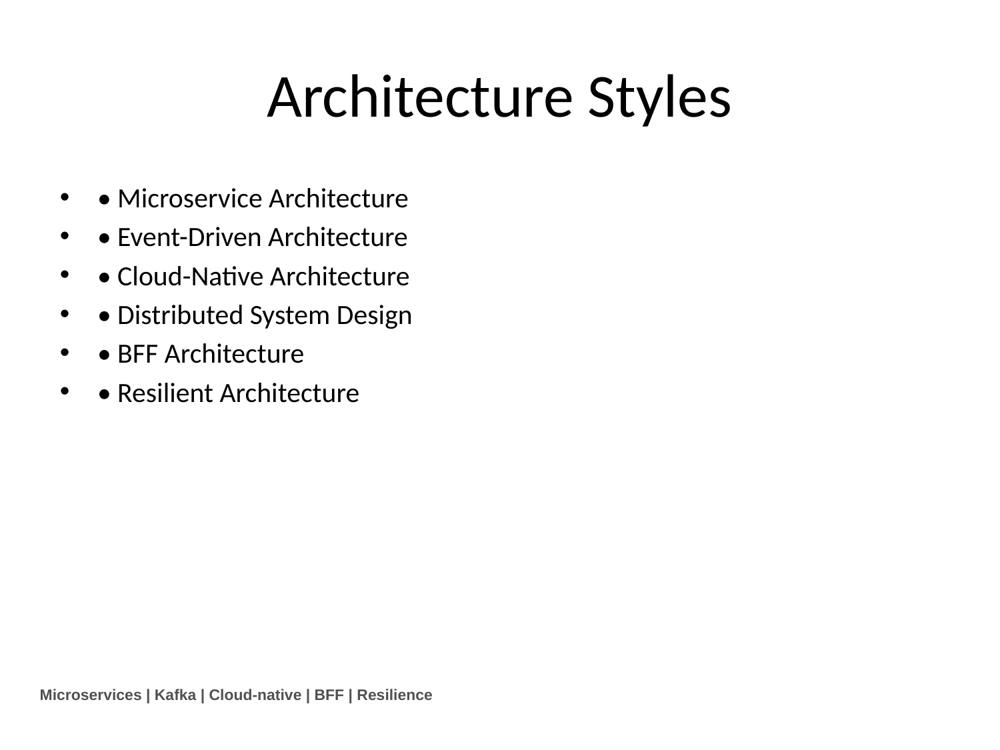

The project demonstrates multiple enterprise architecture styles:

| Architecture Style | How it is implemented |
|---|---|
| Microservice Architecture | Domain-based services such as user, product, cart, order, payment, delivery, notification, AI services |
| Event-Driven Architecture | Kafka-based communication for order, payment, delivery, notification, and retention workflows |
| Cloud-Native Architecture | Dockerized services deployed on Google Kubernetes Engine |
| BFF Architecture | Next.js BFF handles UI, auth flow, API orchestration, and frontend-specific needs |
| Distributed System Design | Independent services, async events, gateway routing, service-to-service communication |
| Resilient Architecture | Gateway fallback, rate limiting, isolated services, Kubernetes self-healing |
| AI Agent Architecture | Gemini-based contextual reasoning and Kafka event triggering for retention workflows |

---

## 4. High-Level System Architecture

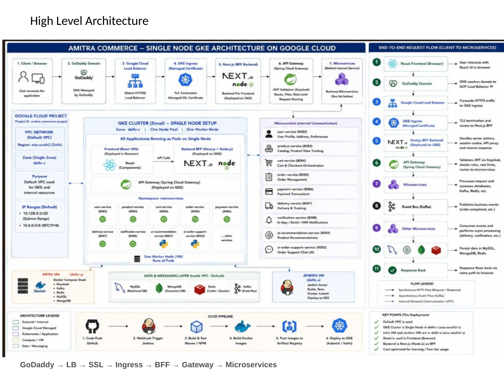

### Request Flow

```text
Browser
  ↓
GoDaddy Domain
  ↓
Google Cloud Load Balancer
  ↓
Managed SSL Certificate
  ↓
GKE Ingress
  ↓
Next.js BFF
  ↓
Spring Cloud API Gateway
  ↓
Backend Microservices
```

### Key Points

- The public entry point is the domain mapped through Google Cloud Load Balancer.
- HTTPS termination is handled using Google-managed certificate integration.
- GKE Ingress routes traffic to the Next.js BFF.
- Next.js BFF handles frontend rendering and secure user flow.
- API Gateway routes secured API requests to backend microservices.
- Backend services are independently deployed as Kubernetes deployments.

---

## 5. Core Services Overview

| Service | Technology | Responsibility |
|---|---|---|
| `nextjs-bff` | Next.js, React, Node.js | Frontend UI, BFF orchestration, login/callback flow, secure cookie handling, GraphQL aggregation |
| `api-gateway` | Spring Cloud Gateway | Central routing, JWT validation, OAuth2 security, rate limiting, fallback |
| `user-service` | Java 21, Spring Boot | User profile and account APIs |
| `product-service` | Java 21, Spring Boot | Product catalog and product retrieval APIs |
| `product-batch-service` | Java 21, Spring Boot, GCS | Bulk product upload from Google Cloud Storage bucket |
| `cart-service` | Java 21, Spring Boot | Shopping cart operations |
| `order-service` | Java 21, Spring Boot, Kafka | Order lifecycle, order status, event consumption |
| `payment-service` | Java 21, Spring Boot, Kafka | Payment workflow and payment events |
| `delivery-service` | Java 21, Spring Boot, Kafka | Delivery creation and delivery status workflow |
| `notification-service` | Java 21, Spring Boot, Kafka | Event-driven customer notifications |
| `ai-recommendation-service` | Python, FastAPI, Gemini | AI product recommendation workflow |
| `ai-order-support-service` | Python, FastAPI, Gemini, Redis, MongoDB, Kafka | AI order support chat and retention agent |

---

## 6. Authentication & Security Flow

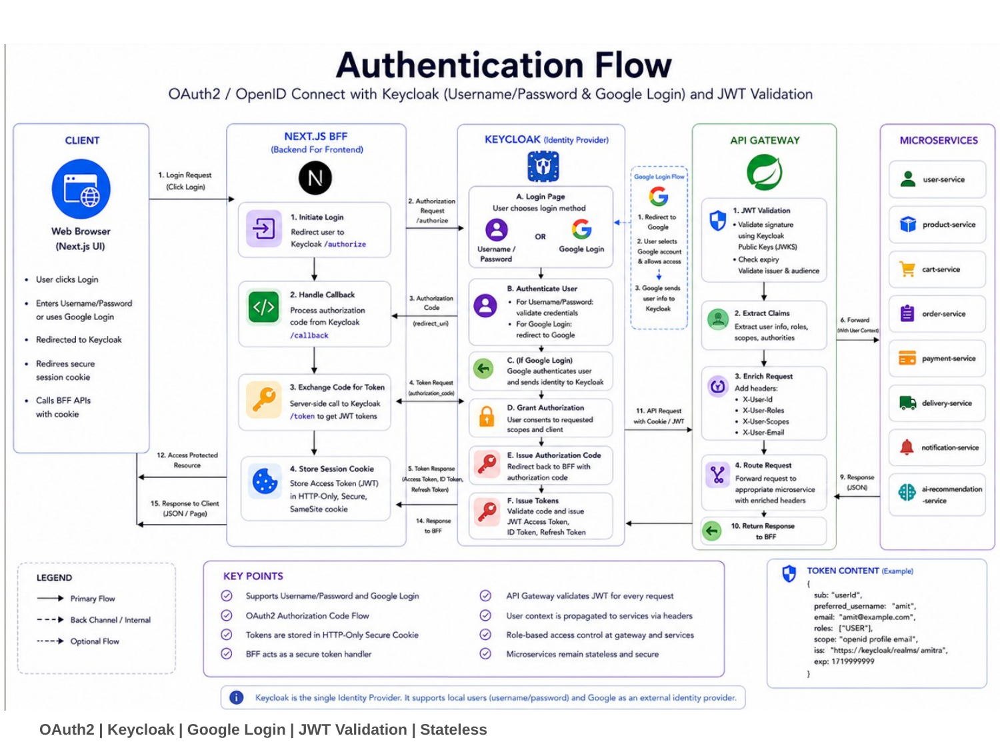

### Security Design

The platform uses Keycloak and OAuth2/JWT-based security.

```text
User Login
  ↓
Next.js BFF redirects to Keycloak
  ↓
User authenticates
  ↓
Keycloak returns authorization response
  ↓
BFF exchanges token and stores secure HttpOnly cookies
  ↓
API calls carry authentication context
  ↓
API Gateway validates JWT
  ↓
Requests are routed to secured microservices
```

### Security Capabilities

- OAuth2 login flow
- JWT token validation
- HttpOnly cookie-based browser security
- API Gateway security enforcement
- Role-aware request propagation
- Service-level authorization design
- Secrets externalized from source code

---

## 7. Order and Event-Driven Workflow

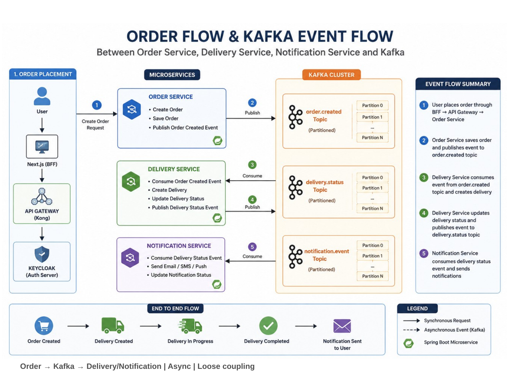

### Order Flow

```text
Customer places order
  ↓
Order Service creates order
  ↓
Payment Service processes payment
  ↓
Payment event published to Kafka
  ↓
Order Service consumes payment event
  ↓
Delivery Service starts delivery workflow
  ↓
Delivery event published to Kafka
  ↓
Notification Service sends customer communication
```

### Why Kafka is Used

Kafka is used to decouple services and support asynchronous workflows.

Benefits:

- Loose coupling between services
- Better scalability
- Async processing
- Event replay capability
- Service failure isolation
- Real enterprise event-driven design

---

## 8. Product Batch Service - Bulk Product Upload from GCS

The Product Batch Service supports bulk product onboarding by reading product files from Google Cloud Storage.

### Business Purpose

In real commerce platforms, catalog teams often need to upload thousands of products. Creating every product manually through API or UI is inefficient. The Product Batch Service supports file-based product ingestion.

### Batch Processing Flow

```text
Product CSV file uploaded
  ↓
Google Cloud Storage bucket
  ↓
Product Batch Service reads file
  ↓
Validate product rows
  ↓
Transform CSV records into product domain model
  ↓
Insert / update product catalog
  ↓
Store processing result or status
```

### Responsibilities

- Read CSV files from Google Cloud Storage bucket
- Validate required product fields
- Transform file data into product objects
- Support bulk catalog onboarding
- Keep batch processing separate from online product APIs
- Support future scheduling/manual trigger design

### Enterprise Value

- Reduces manual catalog maintenance
- Supports business operations teams
- Separates batch workload from real-time APIs
- Aligns with enterprise data ingestion patterns
- Cloud-native integration with GCS

---

## 9. AI Recommendation Flow

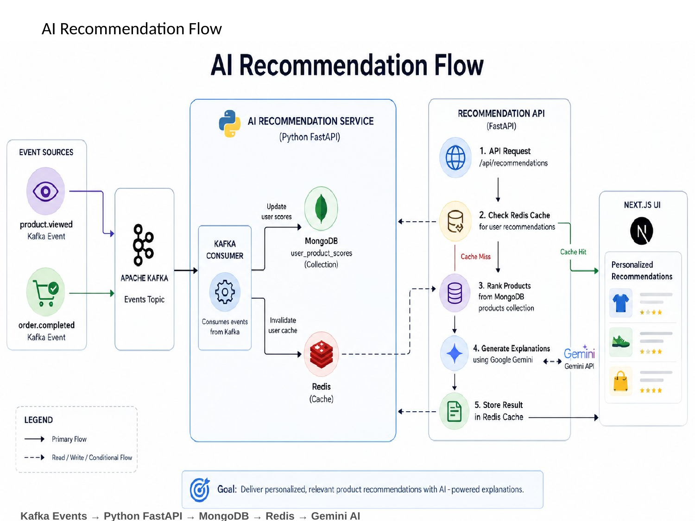

### Flow

```text
User / product / order events
  ↓
Kafka event stream
  ↓
AI Recommendation Service
  ↓
MongoDB context / product data
  ↓
Redis cache
  ↓
Gemini AI reasoning
  ↓
Personalized recommendation response
```

### Capabilities

- AI-assisted product recommendation
- Context-aware recommendation generation
- Product and user context usage
- FastAPI-based AI microservice
- Gemini model integration
- Redis caching support

---

## 10. AI Order Support Chat

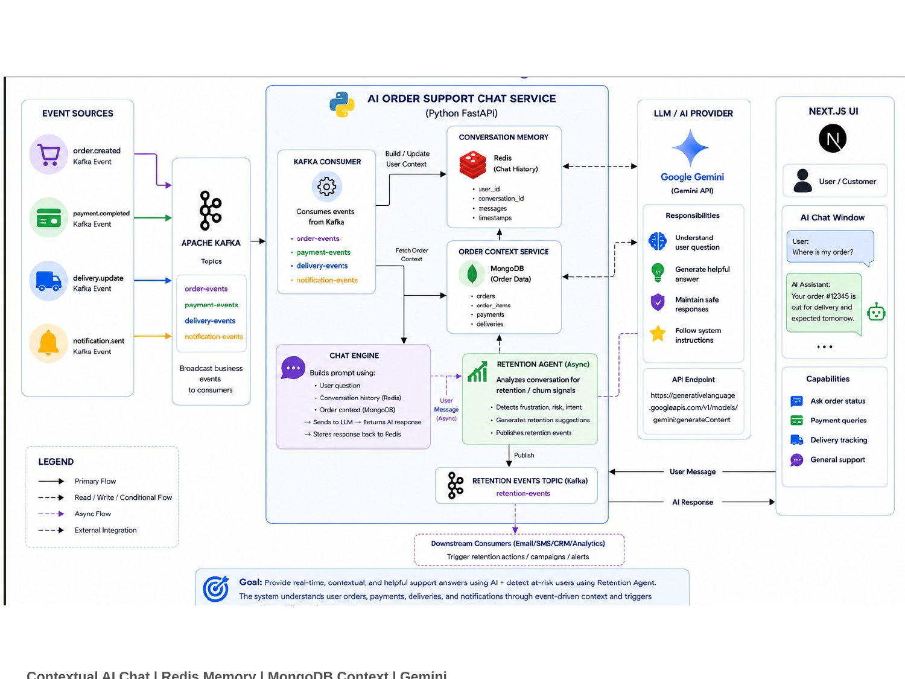

### Purpose

The AI Order Support Service helps customers ask order-related questions such as:

- Where is my order?
- What is the delivery status?
- Why is my payment pending?
- What happened to my order?
- Can I get help with a delayed order?

### Flow

```text
Customer chat message
  ↓
Next.js BFF
  ↓
AI Order Support Service
  ↓
Redis conversation history
  ↓
MongoDB / order context
  ↓
Gemini AI
  ↓
Contextual support response
```

### Design Highlights

- Contextual AI response generation
- Redis-based conversation memory
- Order-specific support context
- FastAPI AI service
- Gemini integration
- Kafka event publishing for support events

---

## 11. AI Retention Agent Upgrade

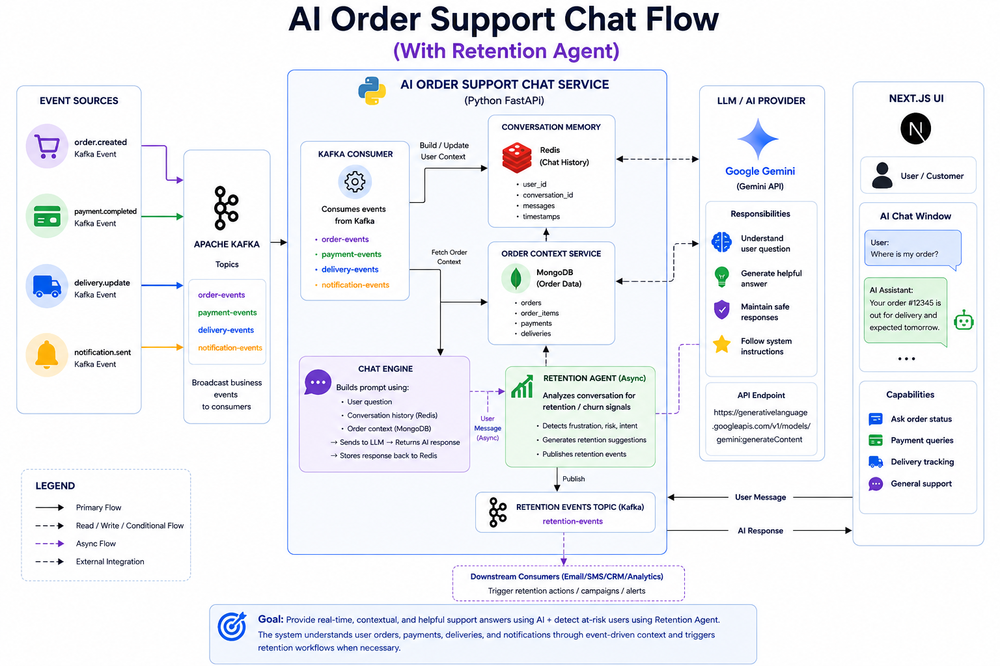

### Why This Upgrade Was Added

Traditional support systems are reactive. They respond after the customer has already raised an issue or cancelled the order.

The retention agent changes this approach.

It detects customer frustration and cancellation risk while the conversation is still active.

### Retention Agent Flow

```text
Customer sends frustrated message
  ↓
Existing AI chat generates normal response
  ↓
Silent retention agent runs asynchronously
  ↓
Gemini performs contextual reasoning
  ↓
If cancellation / churn risk is detected
  ↓
Kafka event is published
  ↓
Future support / CRM / notification workflow can act proactively
```

### What the Agent Detects

- Cancellation intent
- Delivery dissatisfaction
- Refund frustration
- Repeated complaints
- Churn risk
- Negative customer sentiment

### Why It Is Agentic

This is not simple keyword matching.

The agent uses LLM-based contextual reasoning and function/tool-calling style design. The AI determines whether a retention action is needed, and the application layer safely publishes Kafka events.

```text
LLM = reasoning and decision layer
Application = safe execution layer
Kafka = event communication layer
```

### Business Benefit

- Retain customers before cancellation
- Reduce refund and logistics impact
- Improve customer experience
- Enable proactive support
- Create foundation for CRM automation
- Convert support chat into revenue-protection workflow

---

## 12. Resilience, Scaling and Gateway Capabilities

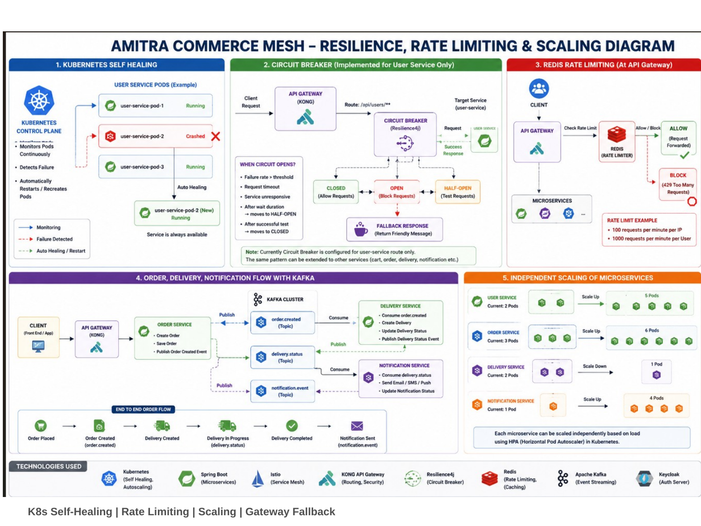

### Capabilities

- Kubernetes self-healing
- Rolling deployments
- Redis rate limiting
- API Gateway fallback
- Independent service scaling
- Containerized workloads
- Health checks
- Deployment isolation

### API Gateway Role

The API Gateway provides:

- Central API entry point
- JWT validation
- Route-level security
- Rate limiting
- Circuit breaker and fallback design
- Microservice routing

---

## 13. CI/CD Deployment Flow

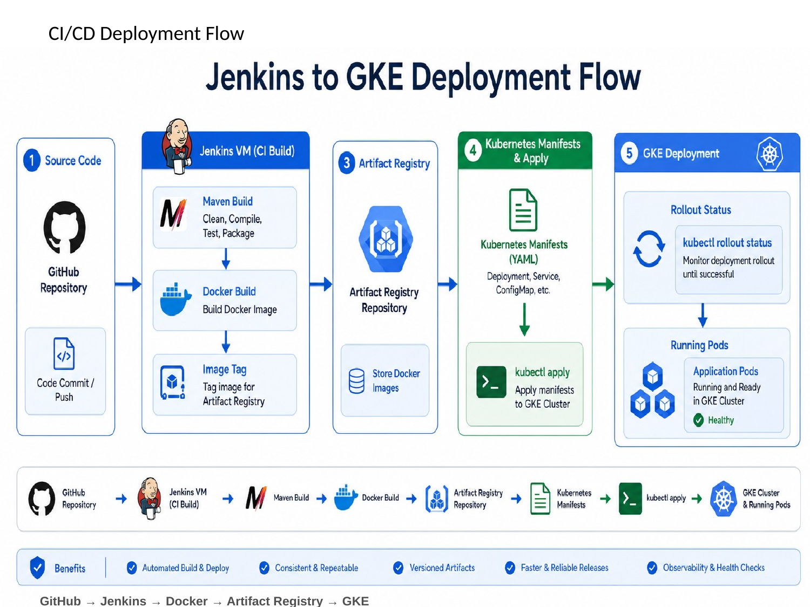

### Pipeline Flow

```text
Developer pushes code to GitHub
  ↓
Jenkins pipeline starts
  ↓
Maven / Docker build executes
  ↓
Docker image pushed to Artifact Registry
  ↓
Kubernetes YAML applied
  ↓
Deployment image updated
  ↓
Rollout status verified
```

### CI/CD Features

- Per-service build and deployment
- Docker image creation
- Artifact Registry integration
- GKE deployment automation
- Kubernetes rollout verification
- Secret Manager integration
- ConfigMap application
- Ingress deployment for BFF

---

## 14. GCP Security and Network Segmentation

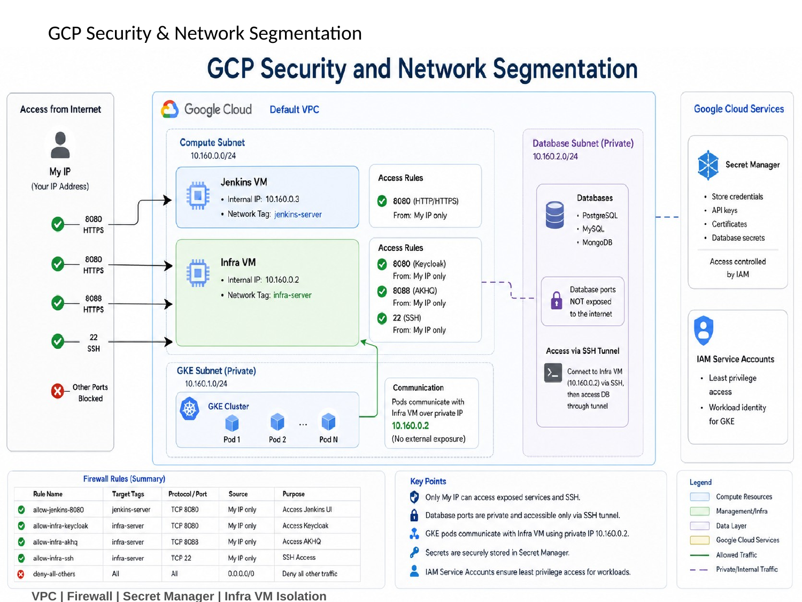

### Cloud Components

- Google Kubernetes Engine
- Google Cloud Load Balancer
- Google Managed Certificate
- Google Artifact Registry
- Google Secret Manager
- Google Cloud Storage
- Google Compute Engine
- VPC and firewall rules

### Security Considerations

- Secrets stored outside source code
- Kubernetes secrets generated from Secret Manager
- Firewall restrictions for infrastructure access
- GKE namespace isolation
- HTTPS traffic through managed certificate
- Backend services not directly exposed publicly

---

## 15. Key Technical Highlights

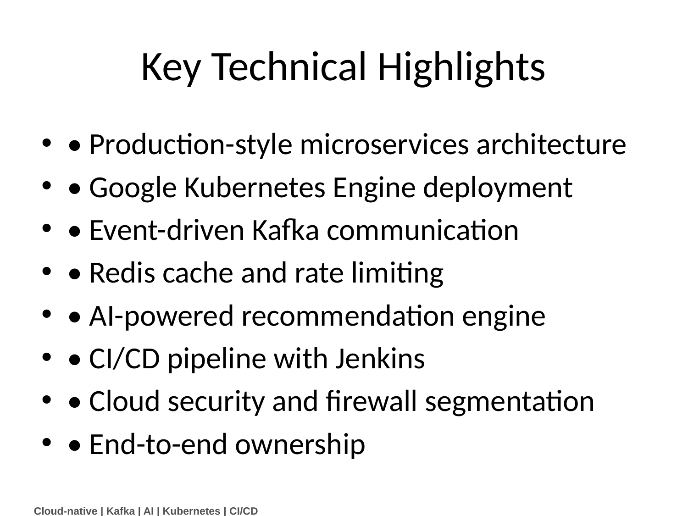

- Production-style microservices architecture
- Google Kubernetes Engine deployment
- Event-driven Kafka communication
- Redis cache and rate limiting
- AI-powered recommendation engine
- AI-powered order support chat
- AI retention agent upgrade
- Product batch service using GCS
- CI/CD pipeline with Jenkins
- Cloud security and firewall segmentation
- End-to-end system ownership

---

## 16. Selected API Surface

The exact API paths may evolve, but the project follows these API responsibility areas.

### API Gateway

```text
/api/users/**
/api/products/**
/api/cart/**
/api/orders/**
/api/payments/**
/api/deliveries/**
/api/notifications/**
/api/ai/**
```

### AI Order Support

```text
POST /api/support-chat/message
GET  /health
```

### AI Recommendation

```text
POST /api/recommendations
GET  /health
```

### Product Batch

```text
Batch trigger / scheduled processing / GCS file ingestion workflow
```

---

## 17. Repository Structure

```text
amitra-commerce-mesh-gcp/
├── api-gateway/
├── nextjs-bff/
├── user-service/
├── product-service/
├── product-batch-service/
├── cart-service/
├── order-service/
├── payment-service/
├── delivery-service/
├── notification-service/
├── ai-recommendation-service/
├── ai-order-support-service/
├── k8s/
│   ├── base/
│   └── overlays/gcp/
└── Jenkinsfile
```

---

## 18. Technology Stack

| Area | Technologies |
|---|---|
| Backend | Java 21, Spring Boot, Spring Cloud, Spring Security, JPA/Hibernate |
| Frontend | React, Next.js, Node.js, GraphQL |
| AI | Python, FastAPI, Gemini AI |
| Messaging | Apache Kafka |
| Cache | Redis |
| Databases | MySQL, MongoDB |
| Authentication | Keycloak, OAuth2, JWT |
| Cloud | Google Cloud Platform |
| Containers | Docker |
| Orchestration | Kubernetes, GKE |
| CI/CD | Jenkins, Artifact Registry |
| Storage | Google Cloud Storage |
| Security | Secret Manager, Kubernetes Secrets, HTTPS, Managed Certificates |

---

## 19. Deployment Summary

### Local/CI Build

```text
Maven build for Java services
Docker build for each service
Docker push to Artifact Registry
```

### GKE Deployment

```text
kubectl apply namespace
kubectl apply configmap
kubectl apply service yaml
kubectl set image deployment
kubectl rollout status
```

### Ingress Deployment

```text
Domain -> Google Load Balancer -> Managed Certificate -> GKE Ingress -> Next.js BFF
```

---

## 20. Security Notice

This public repository is sanitized.

The following are not committed:

- API keys
- Database passwords
- OAuth client secrets
- JWT secrets
- Cloud credentials
- Environment-specific sensitive values

Secrets should be managed using:

- Google Secret Manager
- Kubernetes Secrets
- CI/CD secret injection

---

## 21. What This Project Demonstrates

This project demonstrates readiness for roles involving:

- Senior Backend Engineering
- Microservices Architecture
- Cloud-Native Engineering
- Solution Architecture
- Legacy Modernization
- Event-Driven Architecture
- Kafka-based system design
- AI integration in enterprise platforms
- Kubernetes deployment ownership
- End-to-end system design

---

## 22. Author

**Amit Laha**

Senior Backend Engineering Professional with experience in Java, Spring Boot, Microservices, Kafka, Kubernetes, Legacy Modernization, and AI-powered distributed systems.

---

## 23. Presentation Reference

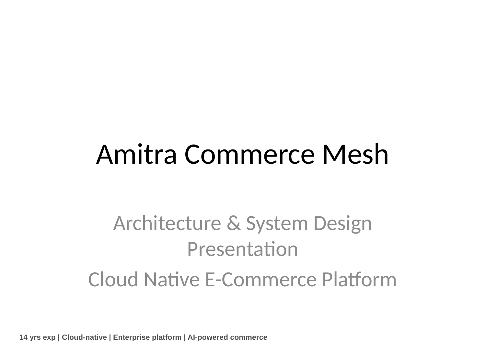

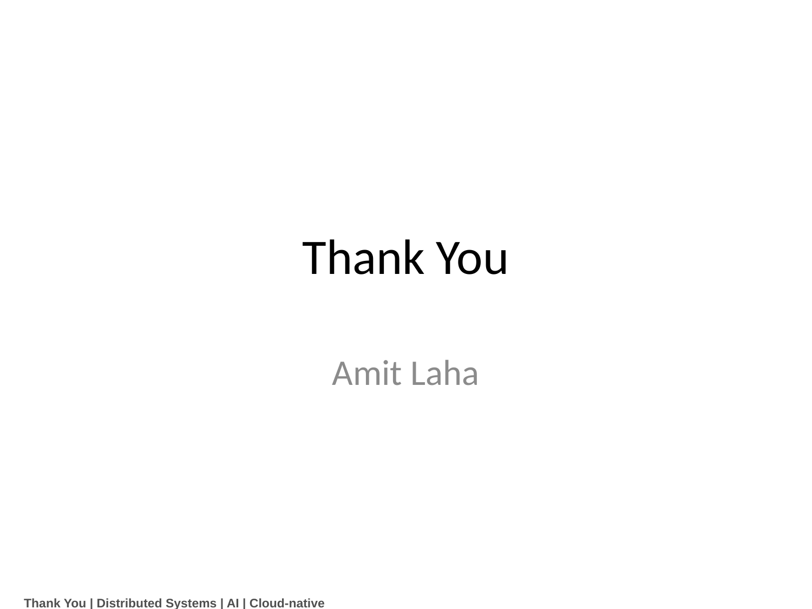
